<div align="center">
  

  # Qdrant Fabric

  A comprehensive Model Context Protocol (MCP) server providing access to both Qdrant Cloud Management and Database APIs as part of the Infrastructure as a Fabric ecosystem.
</div>

## Features

- **Complete API Coverage**: 189 operations across Cloud Management (118 gRPC) and Database (71 REST) APIs
- **Dual API Support**: Manage cloud infrastructure and perform vector operations
- **Type-Safe**: Full Pydantic validation and type hints
- **Async-First**: Built on modern async Python patterns
- **Well-Tested**: Comprehensive test coverage
- **Fabric Integration**: Seamlessly integrates with AIANA and n8n-fabric

## Infrastructure Fabric

<div align="center">
  
  <br/>
  <em>Complete ecosystem showing local Qdrant, MCP server, cloud management, and fabric integrations</em>
</div>

The qdrant-fabric MCP server sits at the heart of the infrastructure, connecting:
- **Local Qdrant** (localhost:6333) - Your development instance with collections
- **Qdrant Cloud** - Managed clusters, backups, and production infrastructure
- **AIANA** - AI Assistant with semantic memory (`aiana_memories` collection)
- **n8n-fabric** - Workflow automation with vector indexing (`n8n_workflows` collection)

This hybrid architecture enables seamless local development while providing full cloud management capabilities.

## Installation

```bash
pip install qdrant-fabric
```

## Quick Start

### Configure Claude Desktop

Add to your `~/.claude/.mcp.json`:

```json
{
  "mcpServers": {
    "qdrant-fabric": {
      "command": "python",
      "args": ["-m", "qdrant_mcp"],
      "env": {
        "QDRANT_CLOUD_API_KEY": "your-cloud-api-key",
        "QDRANT_API_KEY": "your-database-api-key",
        "QDRANT_URL": "https://your-cluster.qdrant.io"
      }
    }
  }
}
```

### Usage Examples

**List Collections:**
```python
# Claude can use: qdrant_db_collections_list
# Returns all collections in your database
```

**Search Vectors:**
```python
# Claude can use: qdrant_db_points_search
# Search for similar vectors in a collection
```

**Create Cluster:**
```python
# Claude can use: qdrant_cloud_clusters_create
# Create a new managed Qdrant cluster
```

## API Coverage

### Phase 1: Core Database Operations (Implemented)
- ✅ Collections CRUD (6 tools)
- ✅ Points CRUD (10 tools)
- ✅ Vector Search (4 tools)
- ✅ Payload operations (5 tools)
- ✅ Health checks (5 tools)

### Coming Soon
- Phase 2: Cloud Management Essentials
- Phase 3: Advanced Search & Discovery
- Phase 4: Backup & Recovery
- See [API_COVERAGE_PLAN.md](docs/API_COVERAGE_PLAN.md) for full roadmap

## Configuration

### Environment Variables

**Cloud Management API:**
- `QDRANT_CLOUD_API_KEY` - Bearer token for Qdrant Cloud API
- `QDRANT_CLOUD_URL` - Cloud API base URL (default: `https://cloud.qdrant.io`)

**Database API:**
- `QDRANT_API_KEY` - API key for database access
- `QDRANT_URL` - Database URL (e.g., `https://xyz.qdrant.io`)

## Development

### Setup

```bash
git clone https://github.com/yourusername/qdrant-fabric.git
cd qdrant-fabric
pip install -e ".[dev]"
```

### Run Tests

```bash
pytest
```

### Code Quality

```bash
black src/ tests/
ruff check src/ tests/
mypy src/
```

## Architecture

```
qdrant-fabric/
├── src/qdrant_mcp/
│   ├── server.py          # MCP server entrypoint
│   ├── config.py          # Configuration management
│   ├── cloud/             # Cloud Management API tools
│   └── database/          # Database API tools
└── tests/                 # Test suite
```

## Documentation

- [API Coverage Plan](docs/API_COVERAGE_PLAN.md) - Complete roadmap
- [Cloud API Surface](docs/cloud_api_surface.txt) - All gRPC methods
- [Database API Operations](docs/database_api_operations.txt) - All REST endpoints

## Contributing

Contributions welcome! Please read our contributing guidelines and submit PRs.

## License

MIT License - see LICENSE file for details

## Links

- [Qdrant Documentation](https://qdrant.tech/documentation/)
- [Qdrant Cloud Console](https://cloud.qdrant.io/)
- [Model Context Protocol](https://modelcontextprotocol.io/)
