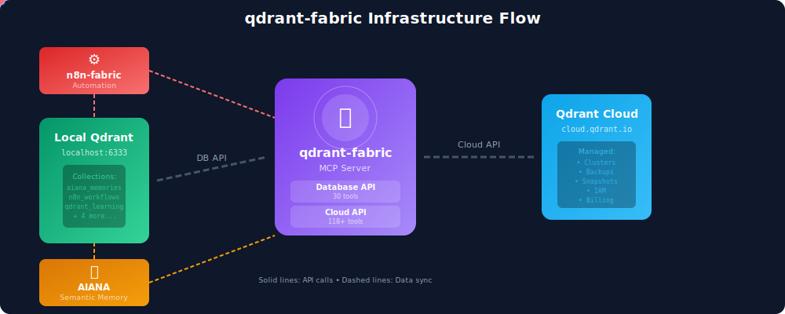

<div align="center">
  

  # Qdrant Fabric

  A comprehensive Model Context Protocol (MCP) server providing access to both Qdrant Cloud Management and Database APIs as part of the Infrastructure as a Fabric ecosystem.
</div>

## Features

- **30 Database Tools**: Complete Phase 1 implementation with all core database operations
- **Full MCP Integration**: Works seamlessly with Claude Desktop and other MCP clients
- **Type-Safe**: Full Pydantic validation and type hints
- **Async-First**: Built on modern async Python patterns
- **Fabric Integration**: Seamlessly integrates with AIANA and n8n-fabric
- **Comprehensive**: Collections, Points, Search, Payload, Health, Vectors, and Index operations

## Infrastructure Fabric

<p align="center">
  
</p>

The qdrant-fabric MCP server sits at the heart of the infrastructure, connecting:
- **Local Qdrant** (localhost:6333) - Your development instance with collections
- **Qdrant Cloud** - Managed clusters, backups, and production infrastructure
- **AIANA** - AI Assistant with semantic memory (`aiana_memories` collection)
- **n8n-fabric** - Workflow automation with vector indexing (`n8n_workflows` collection)

This hybrid architecture enables seamless local development while providing full cloud management capabilities.

## Installation

```bash
pip install qdrant-fabric
```

## Quick Start

### Configure Claude Desktop

Add to your Claude Desktop config (macOS: `~/Library/Application Support/Claude/claude_desktop_config.json`):

```json
{
  "mcpServers": {
    "qdrant-fabric": {
      "command": "uv",
      "args": [
        "run",
        "--directory",
        "/path/to/qdrant-fabric",
        "python",
        "-m",
        "qdrant_mcp"
      ],
      "env": {
        "QDRANT_API_KEY": "your-database-api-key",
        "QDRANT_URL": "http://localhost:6333"
      }
    }
  }
}
```

Or use Python directly:

```json
{
  "mcpServers": {
    "qdrant-fabric": {
      "command": "python",
      "args": ["-m", "qdrant_mcp"],
      "env": {
        "QDRANT_API_KEY": "your-database-api-key",
        "QDRANT_URL": "http://localhost:6333"
      }
    }
  }
}
```

### Available Tools (v0.0.3)

All 30 Phase 1 database tools are now available:

**Collections Management (6 tools)**
- `qdrant_db_collections_list` - List all collections
- `qdrant_db_collections_get` - Get collection details
- `qdrant_db_collections_create` - Create new collection
- `qdrant_db_collections_delete` - Delete collection
- `qdrant_db_collections_update` - Update collection configuration
- `qdrant_db_collections_exists` - Check if collection exists

**Points Operations (7 tools)**
- `qdrant_db_points_upsert` - Insert or update points
- `qdrant_db_points_get` - Retrieve multiple points by ID
- `qdrant_db_points_get_single` - Get single point by ID
- `qdrant_db_points_delete` - Delete points
- `qdrant_db_points_count` - Count points with optional filter
- `qdrant_db_points_scroll` - Scroll through points
- `qdrant_db_points_batch` - Batch point operations

**Vector Search (4 tools)**
- `qdrant_db_points_search` - Vector similarity search
- `qdrant_db_points_search_batch` - Batch search queries
- `qdrant_db_points_recommend` - Recommendation based on examples
- `qdrant_db_points_recommend_batch` - Batch recommendations

**Payload Management (4 tools)**
- `qdrant_db_payload_set` - Set payload (merge with existing)
- `qdrant_db_payload_overwrite` - Overwrite payload (replace)
- `qdrant_db_payload_delete` - Delete specific payload fields
- `qdrant_db_payload_clear` - Clear all payload

**Health Checks (5 tools)**
- `qdrant_db_health_root` - Version and build information
- `qdrant_db_health_check` - Health check
- `qdrant_db_health_liveness` - Liveness probe
- `qdrant_db_health_readiness` - Readiness probe
- `qdrant_db_health_metrics` - Prometheus metrics

**Vector Operations (2 tools)**
- `qdrant_db_vectors_update` - Update vectors for existing points
- `qdrant_db_vectors_delete` - Delete named vectors

**Index Management (2 tools)**
- `qdrant_db_index_create` - Create field index for faster filtering
- `qdrant_db_index_delete` - Delete field index

## API Coverage

### Phase 1: Core Database Operations ✅ Complete (v0.0.3)
- ✅ Collections Management (6 tools)
- ✅ Points Operations (7 tools)
- ✅ Vector Search (4 tools)
- ✅ Payload Management (4 tools)
- ✅ Health Checks (5 tools)
- ✅ Vector Operations (2 tools)
- ✅ Index Management (2 tools)

**Total: 30 tools**

### Coming Soon
- Phase 2: Cloud Management Essentials
- Phase 3: Advanced Search & Discovery
- Phase 4: Backup & Recovery
- See [API_COVERAGE_PLAN.md](docs/API_COVERAGE_PLAN.md) for full roadmap

## Configuration

### Environment Variables

**Cloud Management API:**
- `QDRANT_CLOUD_API_KEY` - Bearer token for Qdrant Cloud API
- `QDRANT_CLOUD_URL` - Cloud API base URL (default: `https://cloud.qdrant.io`)

**Database API:**
- `QDRANT_API_KEY` - API key for database access (optional for local instances)
- `QDRANT_URL` - Database URL (e.g., `http://localhost:6333` or `https://xyz.qdrant.io`)

**Note:** Cloud Management API tools are coming in Phase 2. Currently, only Database API tools are available.

## Development

### Setup

```bash
git clone https://github.com/yourusername/qdrant-fabric.git
cd qdrant-fabric
pip install -e ".[dev]"
```

### Run Tests

```bash
pytest
```

### Code Quality

```bash
black src/ tests/
ruff check src/ tests/
mypy src/
```

## Architecture

```
qdrant-fabric/
├── src/qdrant_mcp/
│   ├── server.py          # MCP server entrypoint
│   ├── config.py          # Configuration management
│   ├── cloud/             # Cloud Management API tools
│   └── database/          # Database API tools
└── tests/                 # Test suite
```

## Documentation

- [API Coverage Plan](docs/API_COVERAGE_PLAN.md) - Complete roadmap
- [Cloud API Surface](docs/cloud_api_surface.txt) - All gRPC methods
- [Database API Operations](docs/database_api_operations.txt) - All REST endpoints

## Contributing

Contributions welcome! Please read our contributing guidelines and submit PRs.

## License

MIT License - see LICENSE file for details

## Links

- [Qdrant Documentation](https://qdrant.tech/documentation/)
- [Qdrant Cloud Console](https://cloud.qdrant.io/)
- [Model Context Protocol](https://modelcontextprotocol.io/)
