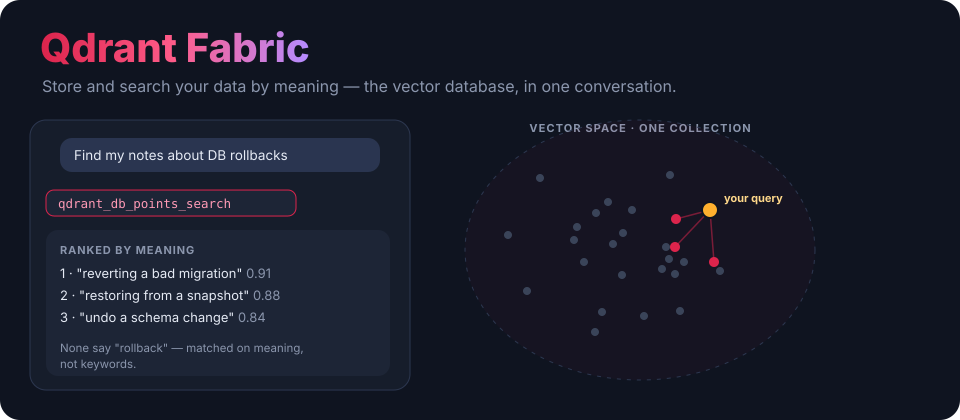
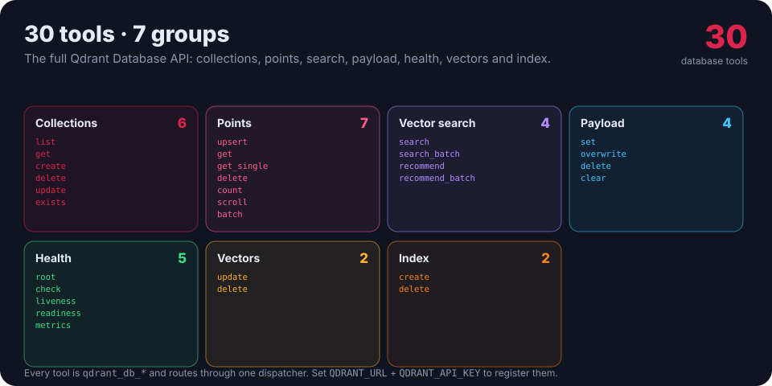

<p align="center">
  
</p>

<h1 align="center">Qdrant Fabric</h1>

<p align="center"><b>Store and search your data by meaning.</b> A Model Context Protocol server for the <a href="https://qdrant.tech/">Qdrant</a> vector database that gives Claude, or any MCP client, 30 tools for collections, points, semantic search, payloads, vectors and more.</p>

<p align="center">
  
  <a href="https://www.python.org/downloads/"></a>
  <a href="https://modelcontextprotocol.io/"></a>
  
  <a href="LICENSE"></a>
</p>

---

## ✨ Why a vector database

Keyword search finds the words you typed. **Vector search finds what you meant.** Qdrant stores each item as a vector (an embedding), so a query for "rollbacks" surfaces "reverting a migration" and "restoring from a snapshot" even when they never use the word. That's what makes it the memory layer for RAG and AI assistants.

This server wraps Qdrant's Database API so you can drive all of it from a conversation.

## 🧰 30 tools, 7 groups

<p align="center">
  
</p>

| Group | Tools | What for |
|---|--:|---|
| **Collections** | 6 | Create, inspect, update and delete collections |
| **Points** | 7 | Upsert, fetch, delete, count, scroll and batch your vectors + payloads |
| **Vector search** | 4 | Similarity search and recommendations, single or batched |
| **Payload** | 4 | Set, overwrite, delete or clear the metadata on points |
| **Health** | 5 | Version, health, liveness, readiness, Prometheus metrics |
| **Vectors** | 2 | Update or delete named vectors on existing points |
| **Index** | 2 | Create or drop payload field indexes for faster filtering |

Every tool is named `qdrant_db_*` and is dispatched through a single handler. They register only when `QDRANT_URL` and `QDRANT_API_KEY` are set.

## 🚀 Setup

You need **Python 3.10+** with [`uv`](https://github.com/astral-sh/uv), and a running Qdrant.

```bash
# a local Qdrant (or use a Qdrant Cloud URL)
docker run -d -p 6333:6333 -v ~/qdrant_storage:/qdrant/storage qdrant/qdrant

# the server (not published to PyPI — install from source)
git clone https://github.com/ry-ops/qdrant-fabric
cd qdrant-fabric
uv sync          # or: pip install -e .
```

**Connect Claude Desktop** — add to `claude_desktop_config.json` (`~/Library/Application Support/Claude/` on macOS, `%APPDATA%\Claude\` on Windows):

```json
{
  "mcpServers": {
    "qdrant-fabric": {
      "command": "uv",
      "args": ["run", "--directory", "/absolute/path/to/qdrant-fabric", "python", "-m", "qdrant_mcp"],
      "env": {
        "QDRANT_URL": "http://localhost:6333",
        "QDRANT_API_KEY": "your-database-api-key"
      }
    }
  }
}
```

| Variable | Needed | What for |
|---|:---:|---|
| `QDRANT_URL` | ✅ | Qdrant endpoint, e.g. `http://localhost:6333` or a Cloud URL |
| `QDRANT_API_KEY` | for secured instances | Database API key (optional for an open local instance) |
| `QDRANT_CLOUD_API_KEY`, `QDRANT_CLOUD_URL` | — | Reserved for Phase 2 cloud management; not yet wired |

Quit and reopen Claude Desktop to load the server.

## 🗺️ Roadmap

Phase 1 — the 30 database tools above — is **complete (v0.0.4)**. Later phases (cloud management, advanced discovery, backup and recovery) are mapped out in [docs/API_COVERAGE_PLAN.md](docs/API_COVERAGE_PLAN.md). The `cloud/` module is a placeholder until then.

## 🧵 Part of the fabric

Qdrant Fabric is the vector layer of the **Infrastructure as a Fabric** ecosystem: it backs [aiana](https://github.com/ry-ops/aiana)'s semantic memory and [n8n-fabric](https://github.com/ry-ops/n8n-fabric)'s workflow indexing, across a local instance for development and Qdrant Cloud for production.

## 🛠️ Development

```bash
uv sync
python -m qdrant_mcp        # run the server (needs QDRANT_URL/API_KEY)
pytest                      # tests
black src/ tests/ && ruff check src/ tests/ && mypy src/
```

## License

MIT. See [LICENSE](LICENSE).

<!-- org-footer -->
---

<p align="center"><sub>Part of <a href="https://github.com/ry-ops">ry-ops</a> · building the pipes between infrastructure, automation, and observability · built by <a href="https://github.com/ry-ops">ry-ops</a></sub></p>
